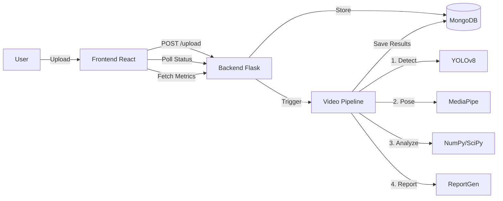

# System Workflow Documentation

## 1. High-Level Architecture
The system follows a linear, asynchronous processing pipeline designed for offline deployment.



---

## 2. Step-by-Step Workflow

### Phase 1: Ingestion
1.  **User Action**: Selects video file on "Upload" page.
2.  **Frontend**: Validates file type/size and sends `POST /api/v1/upload` (via `uploads.py`).
3.  **Backend**:
    *   Saves raw video to `data/uploads/`.
    *   Creates initial record in MongoDB `videos` collection with status `uploaded`.
    *   Returns a unique `video_id`.

### Phase 2: Processing (The Pipeline)
1.  **Trigger**: Frontend automatically requests `POST /api/v1/process/<video_id>` (via `processing.py`).
2.  **Orchestration**: `video_pipeline.py` takes over in a background thread/process.
    *   **Step 1: Detection (YOLOv8)**
        *   Scans video frames to find the swimmer.
        *   Crops/Focuses region of interest (ROI) to reduce noise.
    *   **Step 2: Pose Estimation (MediaPipe)**
        *   Extracts 33 body landmarks (x, y, z) for every frame.
        *   Handles occlusion (e.g., arm underwater) using temporal tracking.
    *   **Step 3: Biomechanical Analytics (`analytics.py`)**
        *   **Kinematics**: Calculates joint angles, limb velocities, and body roll.
        *   **Stroke Analysis**: Detects cycles (Catch/Pull/Push/Recovery) using velocity thresholds.
        *   **Symmetry**: Compares Left vs. Right side metrics.
    *   **Step 4: Feedback Generation**
        *   Compares computed metrics against "ideal" thresholds (e.g., Stroke Rate 30-40 SPM).
        *   Generates text narrative ("Your stroke rate is low...").
    *   **Step 5: Storage**
        *   Saves all metrics to `metrics` collection.
        *   Saves processed frame data to `frames` collection.

### Phase 3: Reporting & Visualization
1.  **Status Updates**: Frontend polls `GET /api/v1/status/<video_id>` or receives WebSocket events to show progress bar.
2.  **Dashboard Load**:
    *   **Video Player**: Fetches original video.
    *   **Overlays**: Fetches skeletal data from `GET /api/v1/frames/<video_id>` to draw lines on canvas.
    *   **Charts**: Fetches numerical data from `GET /api/v1/metrics/<video_id>` to render Plotly graphs.
3.  **Export**:
    *   User clicks "Download Report".
    *   Backend generates a PDF (`reports.py`) combining charts and narrative.

---

## 3. Key Data Structures

### Video Record (MongoDB)
```json
{
  "_id": "video_123",
  "path": "data/uploads/swim_01.mp4",
  "status": "processed",
  "meta": { "fps": 30, "duration": 15.5 }
}
```

### Biomechanical Metrics
```json
{
  "stroke_rate": 32.5,
  "symmetry_index": 0.88,
  "phases": [
    { "name": "catch", "frames": [0, 15] },
    { "name": "pull", "frames": [16, 30] }
  ]
}
```

## 4. Error Handling
- **No Swimmer Detected**: Pipeline aborts at Step 1 if YOLO fails to find a person.
- **Occlusion**: Phases with low confidence keypoints are interpolated or flagged.
- **Upload Failures**: Handled by Flask-Cors and file size limits.
